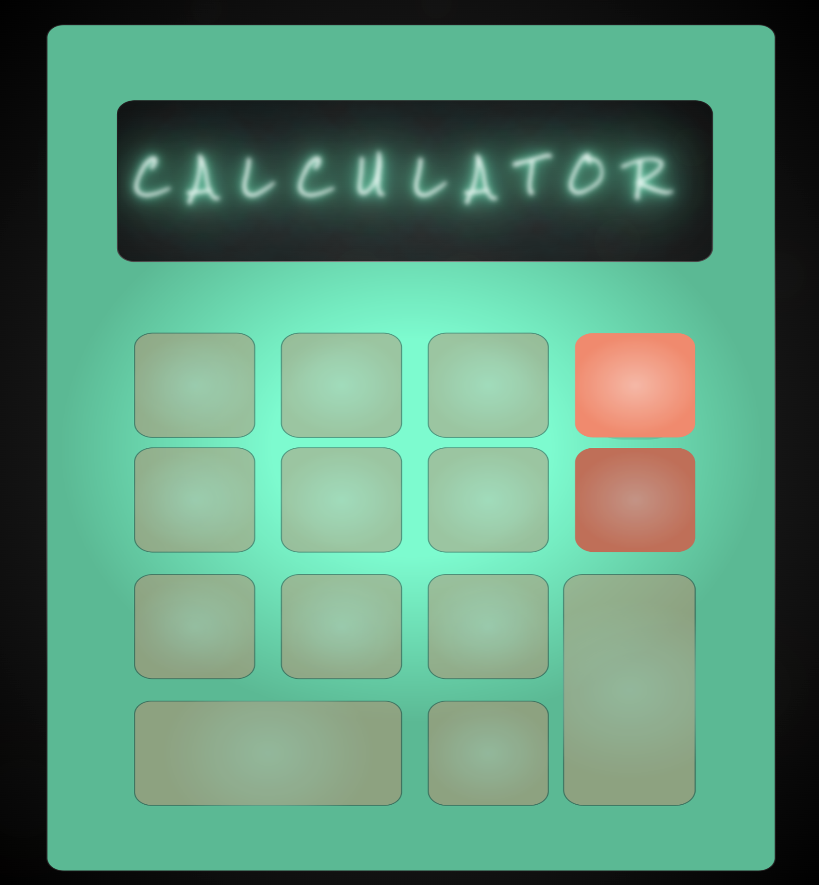
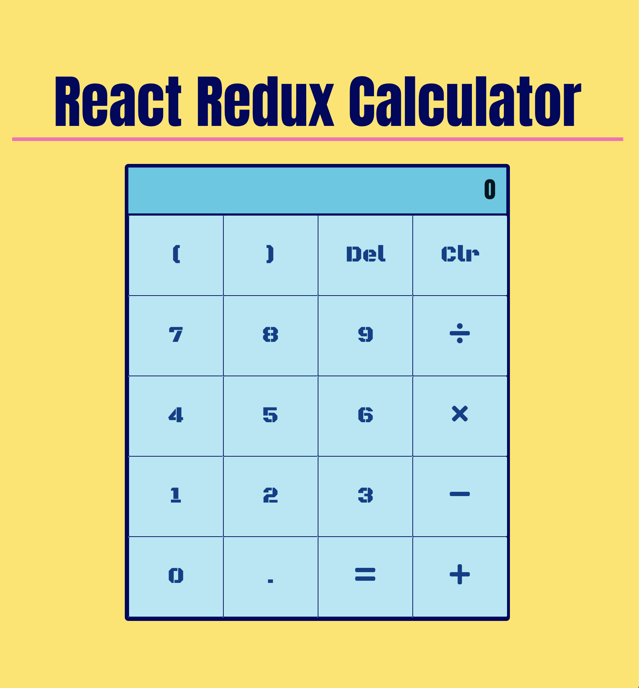

# **React Reux Calculator**

### Click the link to view the website

[Calculator Webstite](https://calculator-ds.herokuapp.com/)

### Description

Simple Calculator build using React and Redux. Utilizing react-spring to include some interesting easy to implement animations

## Screenshot:

[Introduction Page Sceenshot](https://imgur.com/Oe0jOnB)

[Home Page Sceenshot](https://imgur.com/EwxU2WP)

## Technologies Used:

#### 1. HTML5

#### 2. CSS

#### 3. JavaScript

#### 4. Express

#### 5. React

#### 6. React-spring

#### 7. React-Strap

#### 8. Node.js

#### 9. Heroku

#### 10. Github

## Potential Next Steps:

##### - [] Play with css more to make colors pop even more

### Click the link to view the website

[Calculator Webstite](https://calculator-ds.herokuapp.com/)
